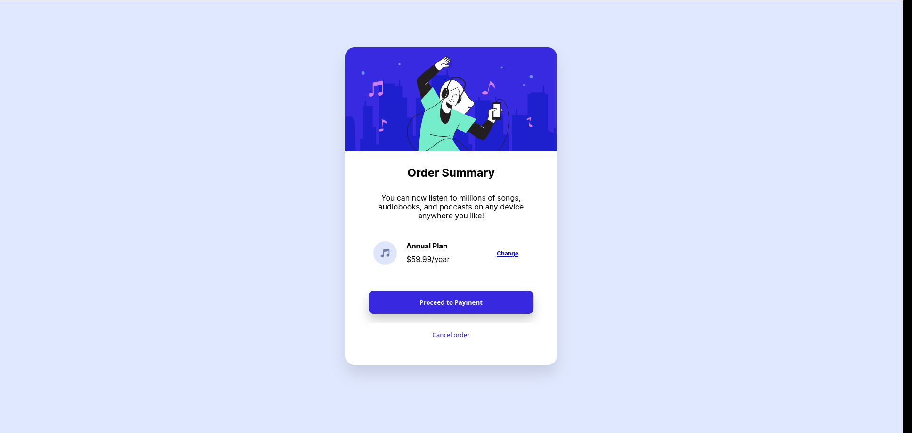

## Overview


### The Challenge
The challenge was taken from Frontendmentor: https://www.frontendmentor.io/challenges/order-summary-component-QlPmajDUj/hub/order-summary-component-SqcPOJx7P7

### Screenshot



## My process
I intended to make the project desktop compatible only. That is so that i could practice more CSS positioning first before moving to responsible design. Overall it took me 1hour to complete. Most likely later projects will have mobile compatability added.

### Built with
-Flexbox
-HTML
-CSS

### What i learned
I came across multible errors
First one was that i wanted to position elements ```h2``` and ```p``` inside ```.plans``` to have ```text-align: left;``` but only the element h2 moved to left, p stayed in it's position. I found out that i had put margin 3rem on p element on everywhere, after specifying class for p element and specifying to remove the margin, it worked fine.

I found Inspect element to be incredible helpful in solving errors.


### Where can i improve
I used ton of margins and manual sizing in order to make section elements so what compatible with each other. The problem with manual sizing is that if i want to change 1 element, I have to change all elements in order to make them compatible with each other again. This would be quite headache when moving on to responsive designs later on.
